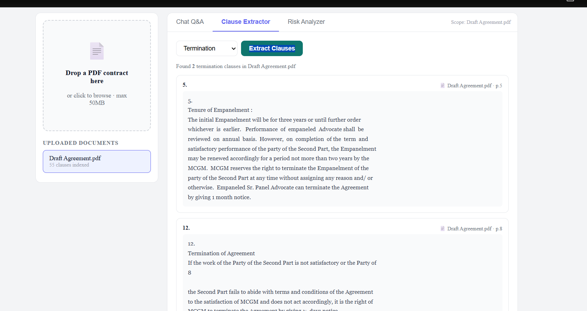
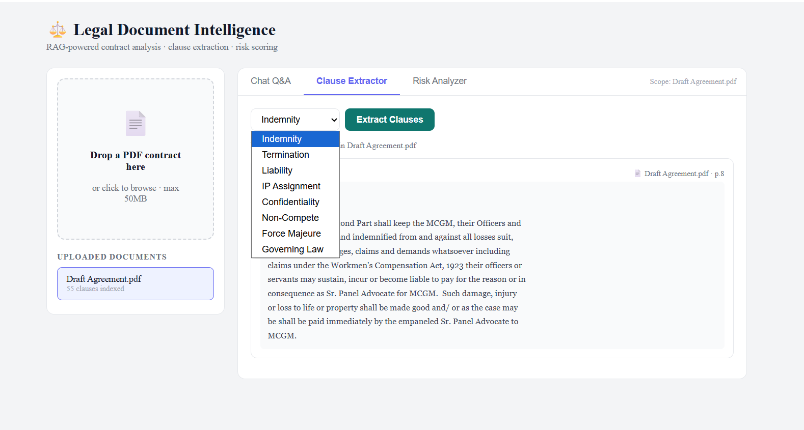
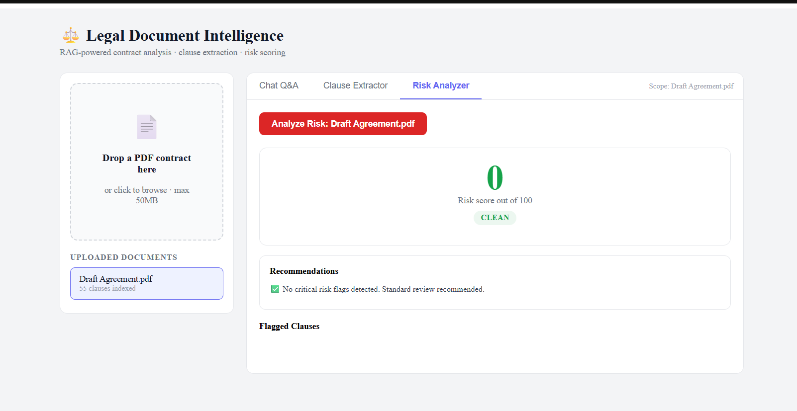

# ⚖️ Legal Document Intelligence System

AI-powered Legal Contract Analysis Platform that enables users to upload contracts, ask natural language questions, extract legal clauses, and assess contractual risk using Retrieval-Augmented Generation (RAG).

Built with FastAPI, React, ChromaDB, Hybrid Search, and Explainable AI principles.

---

## 🚀 Features

### 📄 Contract Upload & Processing

- Upload PDF contracts up to 50 MB
- Automatic text extraction using PyMuPDF
- Clause-aware document chunking

### 🤖 Contract Question Answering

- Ask questions in natural language
- Retrieval-Augmented Generation (RAG)
- Citation-backed responses grounded in source documents

Example:

> "What are the termination conditions in this agreement?"

---

### 🔍 Hybrid Legal Retrieval

Combines:

- Semantic Vector Search
- BM25 Keyword Retrieval

Improving precision for legal terminology and clause discovery.

---

### 📋 Automated Clause Extraction

Extract clauses such as:

- Indemnity
- Termination
- Liability
- Confidentiality
- IP Assignment
- Non-Compete
- Force Majeure
- Governing Law

---

### ⚠️ Explainable Risk Analysis

Rule-based engine identifies:

- Unlimited liability exposure
- Unilateral termination rights
- Missing indemnification protections
- Auto-renewal clauses
- High-risk contractual obligations

Returns:

- Overall risk score
- Flagged clauses
- Recommendations
- Severity breakdown

---

## 🎥 Demo Video

Watch the complete workflow here:

[]

👉 Replace with your YouTube/GitHub video link

Demonstrates:

- Contract Upload
- Clause Extraction
- Legal Q&A
- Risk Analysis

---

## 📸 Application Screenshots

### Clause Extraction Dashboard



---

### Contract Analysis Interface



---

### Risk Analyzer



---

## 🏗️ System Architecture

```text
PDF Upload
    ↓
Document Parsing (PyMuPDF)
    ↓
Clause Boundary Chunking
    ↓
Embedding Generation
    ↓
Vector Database
(ChromaDB / Pinecone)
    ↓
Hybrid Retrieval
(BM25 + Vector Search)
    ↓
LLM Layer
(OpenAI / Anthropic / Ollama)
    ↓
Answer Generation
with Citations
    ↓
Clause Extraction
&
Risk Assessment
```